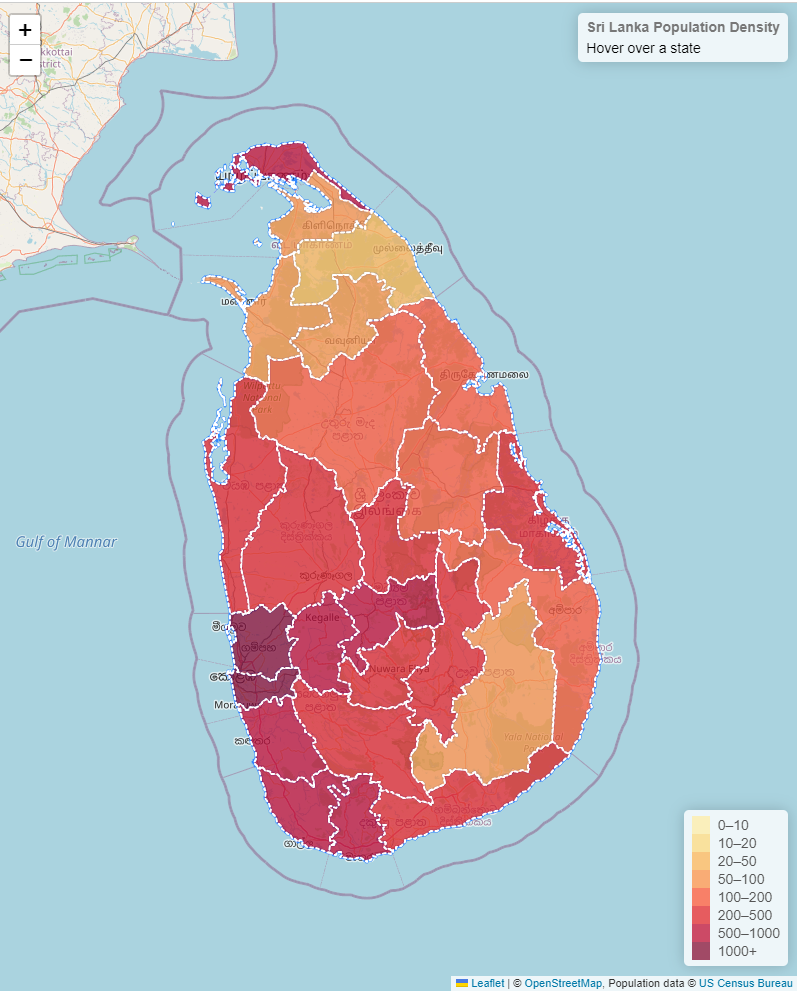

# Leaflet Heatmap template
This map uses a [Leaflet.Heat](https://github.com/Leaflet/Leaflet.heat) plugin
to transform polygons  into a density  layer.

(https://manojssu2000.github.io/SL-Population-density-heatmap/)

## Make your own

1. Press **Use this template** button to create a copy of this repository in your own GitHub account.
2. Modify map's title and description inside `index.html`.

<iframe width="1306" height="805" seamless frameborder="0" scrolling="no" src="https://docs.google.com/spreadsheets/d/e/2PACX-1vQDxVaExynvHFIFaX8efy9V1-tz1nNKW5gYB0hR58AU-guG40EZLMrMjneKo3k1LGiYMca6oHXkNLNa/pubchart?oid=806647056&amp;format=interactive"></iframe>

<iframe title="slecongdpdebt" width="1140" height="541.25" src="https://app.powerbi.com/reportEmbed?reportId=c9d3bc48-cf33-4dbd-8e6f-6599b8358f66&autoAuth=true&ctid=cb356782-ad9a-47fb-878b-7ebceb85b86c&config=eyJjbHVzdGVyVXJsIjoiaHR0cHM6Ly93YWJpLWF1c3RyYWxpYS1zb3V0aGVhc3QtcmVkaXJlY3QuYW5hbHlzaXMud2luZG93cy5uZXQvIn0%3D" frameborder="0" allowFullScreen="true"></iframe>
